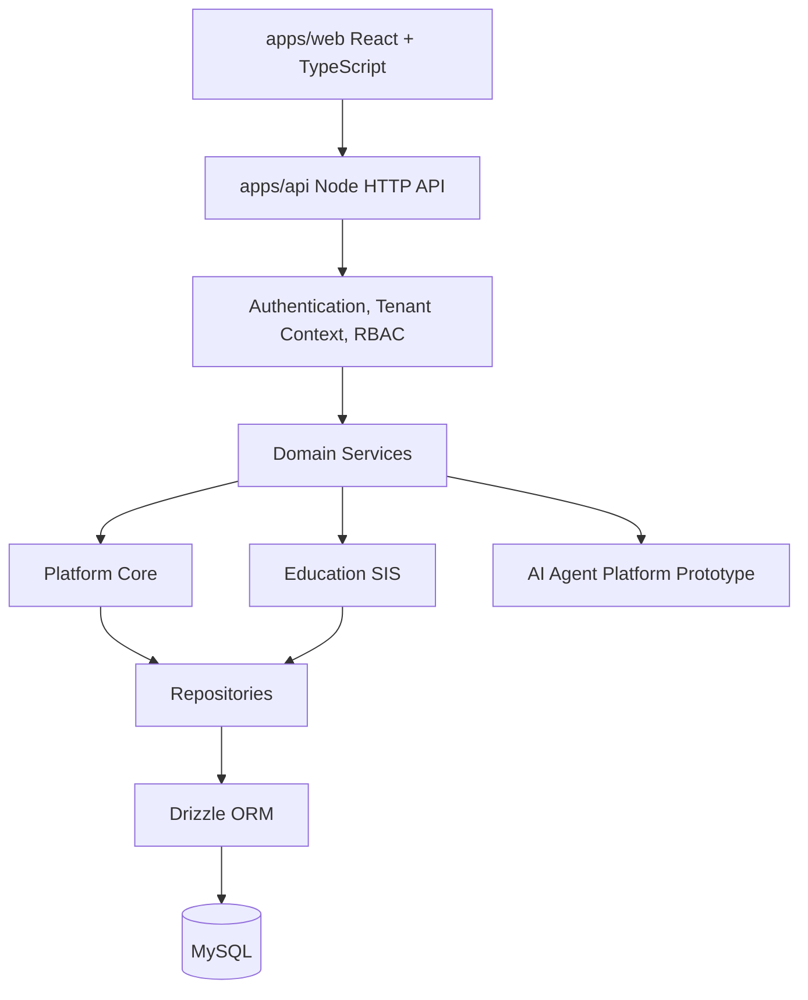
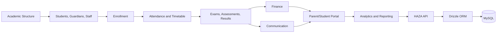

# HAZA AIOS

Multi-Industry AI Operating System for Organizations

HAZA AIOS is a modular platform for organization operations, tenant workspaces, industry-specific modules, AI agent workflows, automation, analytics, and reporting. The repository currently contains a React web application, a TypeScript API, shared UI/package foundations, persistent platform/auth/SIS backend services, and the active database retrofit documentation.

The Education Student Information System (SIS) is the most developed industry module. Platform core, SIS persistence, module registry persistence, and AI Agent registry/configuration persistence are implemented through DB-11. Later phases are planned for agent runtime, memory, knowledge, workflow, audit, metering, and production hardening persistence.

## Public Showcase Notice

This repository is public for portfolio/evaluation purposes. Copyright retained. No commercial reuse, redistribution, sublicensing, or production deployment is permitted without written permission from HAZA AIOS.

This is a source-available showcase repository, not an open-source project. It is intended to demonstrate engineering work, architecture, and implementation progress for review purposes.

## Vision

HAZA AIOS is designed around three cooperating layers:

```text
HAZA AIOS
|
+-- Organization Core
+-- Industry Module Framework
+-- AI Agent Platform
```

The platform model is intentionally multi-industry. Education is the current primary implementation, while the architecture is designed to support future Healthcare, Corporate, Government, and other sector-specific modules without hardcoding every domain into the core shell.

## Architecture

Current runtime architecture:



The backend is a custom TypeScript Node HTTP application using a small internal router, request context, CORS/security middleware, validation helpers, domain services, repositories, Drizzle ORM, and MySQL. Frontend screens call service adapters; data-bearing SIS adapters now use API-backed services rather than browser-local authority.

## Technology Stack

| Area | Current stack |
| --- | --- |
| Frontend | React `^19.2.8`, TypeScript `~5.8.3`, Vite `^8.2.0` |
| Styling/UI | Tailwind CSS `^4.3.3`, `@haza-aios/ui`, Radix UI, shadcn-style component structure |
| Motion/icons | Framer Motion/Motion, Font Awesome, Lucide via shared UI package |
| Backend | Node.js HTTP server, TypeScript, `tsx` for development |
| Database | MySQL, Drizzle ORM `^0.45.2`, Drizzle Kit `^0.31.10`, `mysql2` |
| Testing | Vitest `^4.1.10`, Testing Library, jsdom |
| Tooling | npm workspaces, ESLint, Prettier |
| GitHub workflow | Feature/docs branches merged into `develop` through pull requests |

## Repository Structure

```text
haza-aios/
|-- apps/
|   |-- api/                 # TypeScript API, auth, platform, SIS services, DB access
|   `-- web/                 # React/Vite application and workspace UI
|-- packages/
|   |-- ui/                  # Shared UI primitives
|   |-- config/              # Shared configuration package placeholder
|   `-- types/               # Shared types package placeholder
|-- docs/
|   |-- architecture/        # Platform, tenancy, auth, modules, agent architecture
|   |-- database-migration/  # DB-1 through DB-11 implementation documentation
|   |-- development/         # Frontend and design-system documentation
|   `-- product/             # Product documentation area
|-- scripts/                 # Repository scripts
|-- services/                # Service-level workspace area
|-- src/                     # Root-level source workspace area
|-- package.json             # npm workspace scripts
|-- package-lock.json
|-- .env.example
`-- README.md
```

## Platform Core

Implemented persistent platform capabilities include:

- Organizations, organization settings, workspaces, memberships, and workspace memberships.
- Module activation state through organization module records.
- Users, password hashing, authentication sessions, roles, permissions, membership-role assignments, and security events.
- Server-side authentication, tenant context resolution, permission checks, and tenant-scoped repository access.
- Workspace shell, organization switching, protected routes, member management, active modules, settings, and platform-admin UI foundations.

Module registry persistence is implemented through DB-10. DB-11 adds persistent AI Agent registry and configuration foundations, while later database phases are planned for runtime, conversations, memory, knowledge, and workflow persistence.

## Education SIS

Education is currently the most complete industry module. Its data-bearing workflows have been migrated through DB-9, with platform module registry persistence through DB-10 and AI Agent registry/configuration persistence through DB-11.

| Module | Original Epic | Persistence Status | Backend/API Status |
| --- | --- | --- | --- |
| Student Management | 10A | Database-backed | API-backed |
| Staff & Teacher Management | 10B | Database-backed | API-backed |
| Academic Structure | 10C | Database-backed | API-backed |
| Enrollment | 10A/10C | Database-backed | API-backed |
| Attendance | 10D | Database-backed | API-backed |
| Timetable | 10E | Database-backed | API-backed |
| Examinations | 10F | Database-backed | API-backed |
| Assessments | 10F | Database-backed | API-backed |
| Results | 10F | Database-backed | API-backed |
| Finance | 10G | Database-backed | API-backed |
| Communication | 10H | Database-backed | API-backed |
| Parent/Student Portal | 10I | Policy/request data database-backed; dashboards are authorized projections | API-backed |
| Analytics & Reporting | 10J | Derived from persisted SIS tables | API-backed |

### SIS Data Flow



## Production Database Retrofit

The project has been moving from a frontend prototype persistence model to a durable backend architecture while preserving existing UI contracts.

Initial prototype shape:

```text
React -> frontend services -> localStorage / mock data / in-memory registries
```

Current database-backed shape for completed areas:

```text
React -> API -> Authentication -> Tenant Context -> RBAC -> Domain Services -> Repositories -> Drizzle ORM -> MySQL
```

### Database Roadmap

| Phase | Scope | Status |
| --- | --- | --- |
| DB-0 | Architecture & Migration Baseline | COMPLETE |
| DB-1 | Backend Application Foundation | COMPLETE |
| DB-2 | MySQL, ORM & Migration Foundation | COMPLETE |
| DB-3 | Organization / Workspace / Tenant Core | COMPLETE |
| DB-4 | Authentication, Users, Roles & Permissions | COMPLETE |
| DB-5 | SIS Core Persistence | COMPLETE |
| DB-6 | Attendance & Timetable Persistence | COMPLETE |
| DB-7 | Examination, Assessment & Results Persistence | COMPLETE |
| DB-8 | Finance, Communication & Portal Persistence | COMPLETE |
| DB-9 | SIS Analytics & Reporting Persistence | COMPLETE |
| DB-10 | Platform Core & Module Registry Persistence | COMPLETE |
| DB-11 | AI Agent Registry & Configuration Persistence | COMPLETE |
| DB-12 | Agent Runtime Persistence | PLANNED |
| DB-13 | Agent Memory Persistence | PLANNED |
| DB-14 | Agent Knowledge Persistence | PLANNED |
| DB-15 | Workflow Persistence | PLANNED |
| DB-16 | Audit/Operational Persistence | PLANNED |
| DB-17 | Usage, Metering & SaaS Persistence | PLANNED |
| DB-18 | Production Hardening | PLANNED |

## AI Agent Platform

The repository includes an industry-neutral AI Agent Platform foundation in the web application:

- Agent template and agent instance domain models.
- Agent registry and marketplace UI.
- Agent configuration/builder flows.
- Agent runtime, execution manager, result processor, context engine, tool registry, memory, knowledge, conversation, and workflow service prototypes.
- Workspace routes for discovery, active agents, configuration, execution, and run history.

Current status includes persistent agent template, definition, activation, configuration, model-reference, tool-assignment, and tenant-ownership foundations through DB-11. Later phases are planned for agent runtime, conversations, memory, knowledge, and workflows. Agents are intended to operate through permission-gated tools provided by host modules rather than directly mutating domain tables.

### Agent Roadmap

```text
Agent Platform Foundation
-> Registry / Marketplace
-> Builder / Configuration
-> Runtime
-> Production Agent
-> Tools / Organization Data
-> Knowledge / Context
-> Memory / Conversation
-> Workflow / Task Orchestration
-> Persistence Retrofit
```

## Multi-Industry Architecture

HAZA AIOS is structured as:

```text
Platform
-> Organization
-> Workspace
-> Enabled Modules
-> Industry-Specific Domains
```

Education SIS is the current full domain implementation. Healthcare, Corporate, Government, and other sectors are architectural targets, not completed modules in the current repository state.

## Multi-Tenancy & Security

Current security and tenancy foundations include:

- Organization and workspace boundaries.
- Authenticated organization membership.
- Server-side tenant context resolution.
- Role and permission enforcement.
- Tenant-scoped repository queries.
- IDOR-resistant route patterns and relationship validation.
- Cross-tenant filter rejection in SIS analytics.
- Same-tenant portal ownership checks where implemented.
- Password hashing and server-side session records.
- Environment-based secret configuration.

Security-sensitive implementation details and real credentials are intentionally not documented in this README.

## Data Persistence

MySQL is the authoritative persistence layer for completed platform/auth/SIS areas:

- Platform and tenant data.
- Users, auth sessions, RBAC, memberships, and security events.
- SIS academic, people, enrollment, attendance, timetable, examination, results, finance, communication, portal policy/request data, analytics, and reports.

Frontend storage may still be used for legitimate UI state, preferences, test fixtures, or modules whose database phases have not yet been completed. Authoritative SIS business data should no longer depend on browser-local storage after DB-9.

## Current Project Status

| Area | Status | Notes |
| --- | --- | --- |
| Platform Foundation | COMPLETE | Core shell, workspaces, organizations, admin foundations, module concepts |
| Education SIS | COMPLETE through Epic 10J | Most developed industry module |
| SIS Database Retrofit | COMPLETE through DB-9 | SIS business data and analytics are API/database-backed |
| AI Agent Platform | PROTOTYPE / IN PROGRESS | Frontend platform, runtime, builder, and workflow foundations exist |
| Agent Database Retrofit | COMPLETE through DB-11 | Registry/configuration persistence complete; runtime/memory/knowledge/workflow phases planned |
| Production Deployment | PLANNED | Hardening and deployment work remains |

## Major Completed Development Areas

- Project foundation, frontend architecture, shared UI structure, and workspace shell.
- Organization/workspace architecture, tenant switching, members, settings, module activation, and platform admin foundations.
- Education SIS Epic 10A through 10J.
- AI Agent Platform foundation through registry, marketplace, builder, runtime, memory, knowledge, conversation, and workflow prototype layers.
- Database retrofit DB-0 through DB-11.

### SIS Epics

| Epic | Module | Current Status |
| --- | --- | --- |
| 10A | Student Management | Implemented; database/API-backed |
| 10B | Staff & Teacher Management | Implemented; database/API-backed |
| 10C | Academic Structure | Implemented; database/API-backed |
| 10D | Attendance | Implemented; database/API-backed |
| 10E | Timetable | Implemented; database/API-backed |
| 10F | Examination / Assessment / Results | Implemented; database/API-backed |
| 10G | Finance | Implemented; database/API-backed |
| 10H | Communication | Implemented; database/API-backed |
| 10I | Parent & Student Portal | Implemented; API-backed with persisted policy/request data |
| 10J | Analytics & Reporting | Implemented; API/database-derived |

## Current Development Focus

Current active database boundary:

```text
DB-11 - AI Agent Registry & Configuration Persistence
```

Later phases are expected to migrate remaining AI Agent/platform persistence: runtime, conversations, memory, knowledge, workflow, audit/operations, usage/metering, and production hardening.

## Development Setup

### Prerequisites

- Node.js and npm compatible with the checked-in `package-lock.json`.
- MySQL for database-backed API work.
- Git and GitHub CLI for the PR workflow.

### Install

```bash
npm install
```

### Environment

Copy the environment examples and fill local values:

```bash
cp .env.example .env
cp apps/web/.env.example apps/web/.env.local
```

Do not commit real credentials.

### Run Locally

```bash
npm run dev:api
npm run dev:web
```

The default API example uses port `8000`. The web example can be configured through `apps/web/.env.local` with `VITE_API_BASE_URL`.

## Environment Configuration

Environment examples are provided in:

- [`.env.example`](.env.example)
- [`apps/web/.env.example`](apps/web/.env.example)

Configuration categories include:

- Application environment and app name.
- API host, port, body limit, web origin, and log level.
- MySQL host, port, database name, test database name, user, password, and pool limit.
- Optional Redis host and port placeholders.
- Web app name, environment, and API base URL.

## Database Setup

Database commands are defined in the API workspace.

```bash
npm run db:create
npm run db:check
npm run db:migrate
npm run db:migrate:status
```

For database integration tests, configure the test database values from `.env.example` and run the API test command with `RUN_DB_INTEGRATION_TESTS=true` in your local shell. The repository includes migration tooling and a seed-policy module, but no production reset workflow is documented here.

## Available Commands

| Command | Purpose |
| --- | --- |
| `npm run dev:web` | Start the web app through the web workspace |
| `npm run dev:api` | Start the API in watch mode |
| `npm run build:web` | Build the web app |
| `npm run build:api` | Build the API |
| `npm run lint:web` | Run web ESLint |
| `npm run lint:api` | Run API ESLint |
| `npm run typecheck:web` | Typecheck the web app |
| `npm run typecheck:api` | Typecheck the API |
| `npm run test:api` | Run API tests |
| `npm run test -w apps/web` | Run web tests |
| `npm run db:create` | Create/configure the local database from API tooling |
| `npm run db:check` | Validate Drizzle schema/migration state |
| `npm run db:generate` | Generate Drizzle migration artifacts |
| `npm run db:migrate` | Apply database migrations |
| `npm run db:migrate:status` | Report migration status |
| `npm run format:check` | Check formatting |
| `npm run check:web` | Run web typecheck, lint, format check, and build |

## Testing

The repository uses Vitest for API and web tests. Current test coverage includes:

- API health/config/database foundations.
- Authentication, RBAC, memberships, tenant isolation, and permission checks.
- Platform core integration.
- SIS core, attendance/timetable, examination/results, finance/communication/portal, analytics/reporting integration tests.
- Web service and route tests for workspace, modules, SIS services, agent services, runtime, workflows, and analytics adapter behavior.

Database integration tests are gated by environment so they can be skipped when MySQL is unavailable.

## Git & Development Workflow

Current workflow:

1. Update `develop`.
2. Create a focused `feature/*` or `docs/*` branch.
3. Implement or document the scoped change.
4. Run relevant validation.
5. Review the diff.
6. Commit.
7. Push the branch.
8. Open a PR into `develop`.
9. Review the PR.
10. Merge with a normal merge commit unless repository policy says otherwise.
11. Update local `develop`.
12. Clean merged branches safely when appropriate.

`develop` is the integration branch. `main` is reserved for production/release usage where applicable.

## Definition of Done

For data-bearing features, UI alone is not complete. The project standard is:

- Domain model and validation.
- Database entities and migrations where persistence is required.
- Backend API, service, repository, and tenant-scoped data access.
- Authentication and RBAC enforcement.
- Cross-tenant and IDOR protection.
- Frontend service integration.
- Tests covering persistence, authorization, tenant isolation, and key workflows.
- Documentation and Git/PR completion.

## Security Principles

- Server-side authorization is authoritative.
- Tenant isolation is enforced by organization/workspace context and repository filters.
- RBAC controls protected reads, mutations, and sensitive workflows.
- Passwords are hashed and secrets are environment-based.
- Financial records, student records, marks/results, portal access, and communications require scoped access.
- Parent/student portal access must be relationship-bound.
- Agents should operate through approved, permission-gated tools rather than direct database table access.

## Roadmap

### Completed / Current

- Platform foundation and organization workspace.
- Education SIS Epic 10A through 10J.
- Database retrofit DB-0 through DB-11.

### Next

- DB-11 - AI Agent Registry & Configuration Persistence.

### Planned

- DB-11 - AI Agent Registry Persistence.
- DB-12 - Agent Runtime Persistence.
- DB-13 - Agent Memory Persistence.
- DB-14 - Agent Knowledge Persistence.
- DB-15 - Workflow Persistence.
- DB-16 - Audit/Operational Persistence.
- DB-17 - Usage, Metering & SaaS Persistence.
- DB-18 - Production Hardening.
- Deployment/pilot readiness.
- Broader multi-industry expansion.

## Documentation

- [DB-0 Architecture & Migration Baseline](docs/architecture/database-retrofit-db-0.md)
- [DB-1 Backend Application Foundation](docs/database-migration/14-db1-backend-foundation.md)
- [DB-2 MySQL, ORM & Migration Foundation](docs/database-migration/15-db2-mysql-orm-migrations.md)
- [DB-3 Organization / Workspace / Tenant Core](docs/database-migration/16-db3-organization-workspace-tenant-core.md)
- [DB-4 Authentication, Users, Roles & Permissions](docs/database-migration/17-db4-auth-users-rbac.md)
- [DB-5 SIS Core Persistence](docs/database-migration/18-db5-sis-core-persistence.md)
- [DB-6 Attendance & Timetable Persistence](docs/database-migration/19-db6-attendance-timetable-persistence.md)
- [DB-7 Examination, Assessment & Results Persistence](docs/database-migration/20-db7-examination-assessment-results-persistence.md)
- [DB-8 Finance, Communication & Portal Persistence](docs/database-migration/21-db8-finance-communication-portal-persistence.md)
- [DB-9 SIS Analytics & Reporting Persistence](docs/database-migration/22-db9-sis-analytics-reporting-persistence.md)`r`n- [DB-10 Platform Core & Module Registry Persistence](docs/database-migration/23-db10-platform-core-module-registry-persistence.md)`r`n- [DB-11 AI Agent Registry & Configuration Persistence](docs/database-migration/24-db11-ai-agent-registry-configuration-persistence.md)
- [Organization Workspace Architecture](docs/architecture/organization-workspace.md)
- [Organization & Multi-Tenancy Architecture](docs/architecture/organizations.md)
- [Authentication Architecture](docs/architecture/authentication.md)
- [Industry Modules Architecture](docs/architecture/industry-modules.md)
- [AI Agent Platform Architecture](docs/architecture/ai-agent-platform.md)
- [Agent Marketplace Architecture](docs/architecture/agent-marketplace.md)
- [Agent Builder Architecture](docs/architecture/agent-builder.md)
- [Frontend Architecture](docs/development/frontend-architecture.md)
- [Frontend Development](docs/development/frontend-development.md)
- [Design System](docs/development/design-system.md)

## Project Stage

HAZA AIOS is under active development. Platform foundations and the Education SIS are substantially implemented, SIS persistence is complete through DB-9, platform module registry persistence is complete through DB-10, and AI Agent registry/configuration persistence is complete through DB-11. Later agent runtime persistence, production deployment hardening, and broader multi-industry modules remain planned/in progress.

## License

This repository is source-available for portfolio/evaluation purposes only. It is not open source. See [LICENSE](LICENSE).

