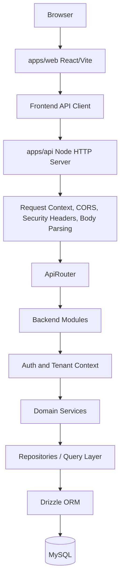
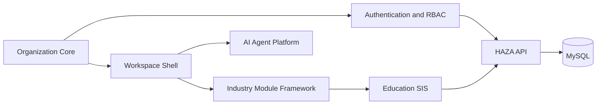
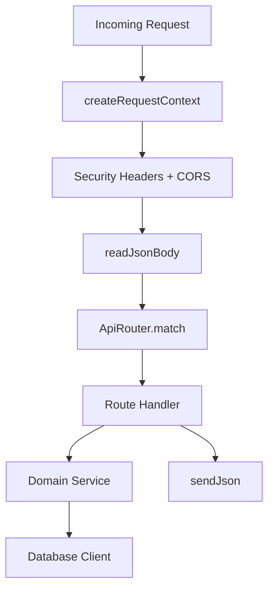
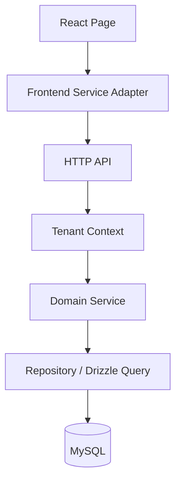

# Project Architecture Blueprint

Generated: 2026-08-27
Repository: HAZA AIOS
Active branch at generation: develop

## 1. Architecture Detection

HAZA AIOS is an npm-workspaces TypeScript monorepo with two primary applications and shared packages:

- `apps/web`: React 19, TypeScript, Vite, Tailwind CSS, shared UI package usage, route-level page composition, frontend service adapters, and workspace/module/SIS/agent UI.
- `apps/api`: custom Node.js HTTP API, TypeScript, internal router, module registry, auth/platform/education modules, Drizzle ORM, MySQL, validation helpers, middleware, and tests.
- `packages/ui`: shared React UI primitives and styling utilities.
- `packages/config` and `packages/types`: package placeholders for shared configuration/types expansion.
- `docs`: architecture, database retrofit, and development documentation.

Detected architecture pattern: modular layered monorepo with a strangler-style persistence retrofit.

The current system is not a microservice architecture. It is a modular monolith at application level: one web app, one API app, multiple bounded backend modules, and shared packages. The API uses explicit route/module registration instead of a framework controller system.

## 2. Architectural Overview

The platform architecture separates concerns into:

- Product/UI routes in the React app.
- Frontend service adapters that hide data-source details from pages.
- API route modules grouped by bounded context.
- Domain services for auth, platform, and Education SIS behavior.
- Repository/data-access layer backed by Drizzle ORM.
- MySQL as the authoritative persistence layer for completed DB phases.

High-level runtime flow:



Guiding principles visible in the codebase:

- Keep UI routes stable while migrating service authority from local/browser state to API-backed persistence.
- Enforce tenant and permission boundaries server-side for data-bearing operations.
- Keep industry modules isolated behind platform/workspace/module contracts.
- Use documentation and PR-based branches to preserve implementation milestones.
- Prefer domain services over page-level data manipulation for business workflows.

## 3. Major Subsystems



### Frontend Application (`apps/web`)

Purpose:

- Render landing, auth, organization, workspace, admin, Education SIS, and agent-platform screens.
- Provide route guards for public/protected/workspace/admin areas.
- Use frontend services as the page-facing API.
- Preserve route and component contracts while backend persistence evolves.

Key patterns:

- `App.tsx` performs route-based page selection.
- `ProtectedRoute`, `PublicOnlyRoute`, and `WorkspaceGuard` enforce client-side navigation rules.
- `AuthProvider` and organization/workspace providers hold user/session/org context.
- SIS page modules call service adapters under `apps/web/src/modules/education/sis`.
- API-backed adapters use `apps/web/src/api/api-client.ts` with `credentials: "include"` and optional bearer tokens.

### Backend Application (`apps/api`)

Purpose:

- Expose `/api/v1` HTTP endpoints.
- Authenticate users, resolve tenant context, and enforce RBAC.
- Host platform and Education SIS domain services.
- Persist authoritative data through Drizzle/MySQL.

Key patterns:

- `createApp` builds a Node HTTP server directly with `node:http`.
- Middleware is applied explicitly: security headers, CORS, request context, JSON body parsing.
- `ApiRouter` performs method/path matching and route parameter extraction.
- Backend modules implement a `register(router)` contract and are registered through `registerModules`.
- Errors are normalized into a JSON envelope with status, code, message, and request id.

### Database Layer

Purpose:

- Provide durable MySQL persistence for completed platform/auth/SIS phases.
- Centralize schema definitions and transaction handling.
- Map database errors into API-level errors.

Key patterns:

- `createDatabaseClient` creates a MySQL pool and Drizzle database instance.
- The database client exposes `db`, `ping`, `close`, and `transaction`.
- Schema definitions live in `apps/api/src/database/schema.ts`.
- Migration files live in `apps/api/src/database/migrations`.
- Migration scripts live in `apps/api/src/database/scripts`.

### Shared UI Package (`packages/ui`)

Purpose:

- Provide shared component and styling primitives for the monorepo.
- Support shadcn-style component organization and reusable UI contracts.

Current package dependencies include React, Radix, Lucide, class variance utilities, `clsx`, `tailwind-merge`, and Tailwind CSS.

## 4. Backend Module Architecture

Backend modules are small registration units:

```text
BackendModule
  -> name
  -> register(router)
```

Current registered modules include:

- Health module: `/api/v1/health`, `/api/v1/readiness`, `/api/v1/liveness`.
- Foundation module: baseline API foundation routes.
- Auth module: register, login, logout, current user.
- Platform module: organizations, workspaces, memberships, modules, platform data.
- Education module: SIS academic, people, enrollment, attendance, timetable, examinations, finance, communication, portal, analytics, and reporting routes.

Route matching is explicit and path-segment based. Dynamic parameters use colon-prefixed route segments such as `:organizationId` and `:id`.



## 5. Frontend Module Architecture

The frontend is route-heavy and module-oriented. `App.tsx` maps paths to page components for:

- Public landing and auth routes.
- Organization creation.
- Workspace overview, members, modules, and settings.
- Education SIS modules: students, staff, academic structure, attendance, timetable, examinations, finance, communication, portal, analytics.
- Agent workspace modules: discover, active agents, details, configure, run, history.
- Platform admin pages.

Frontend module runtime concepts exist under `apps/web/src/modules`:

- `module-registry.ts`: static module definitions and discovery.
- `module-runtime.ts`: organization/module activation runtime behavior.
- `module.types.ts`: module contracts and route/navigation metadata.
- `education/sis/*`: SIS service adapters and types.
- `demo-module`: sample non-production module used to demonstrate dynamic module loading.

## 6. Data Architecture

### Platform/Auth Data

Implemented schema areas include:

- Organizations and organization settings.
- Workspaces and workspace memberships.
- Organization modules.
- Organization memberships.
- Users and authentication sessions.
- Roles, permissions, role permissions, membership roles.
- Security events.

### Education SIS Data

Implemented schema/service areas include:

- Academic years, terms, grades, sections, subjects, class-subject relationships.
- Students, guardians, student-guardian links, enrollments.
- Staff, departments, teaching assignments.
- Attendance sessions and attendance records.
- School schedules, time periods, timetable entries.
- Examinations, examination subjects, assessments, marks, grading rules, result publications.
- Finance categories, structures, assignments, discounts, invoices, payments, receipts.
- Communication announcements, templates, messages, notifications, deliveries, preferences.
- Portal policies and update requests.
- Analytics and reporting derived from persisted SIS source tables.

### Persistence Boundaries



The main retrofit rule is that authoritative data-bearing features should move behind API/domain-service/repository boundaries. Browser storage may still exist for UI state, preferences, tests, demos, or future phases that have not yet been persisted.

## 7. Cross-Cutting Concerns

### Authentication and Authorization

- Auth routes issue session data and set HTTP-only session cookies.
- Frontend auth stores returned session state for UI context.
- Protected API routes authenticate requests through `AuthService`.
- Organization membership and permission checks are server-side for protected resources.
- Tenant-owned resource access uses organization/workspace context rather than trusting arbitrary client values.

### Tenant Isolation

- Tenant boundaries are organization/workspace based.
- Platform and SIS routes include organization scope where needed.
- Services validate relationships, for example cross-tenant filters and linked portal access.
- Repository queries are expected to include tenant filters for tenant-owned data.

### Error Handling

- Backend uses `ApiError` for expected failures.
- Unknown failures are mapped to an internal server error envelope.
- Responses include request ids to support debugging.
- Database errors are mapped through database error helpers.

### Logging and Observability

- API creates structured loggers from loaded config.
- Request completion logs include method, path, status code, request id, and duration.
- Health, readiness, and liveness endpoints expose runtime status.

### Validation

- Auth and platform validation helpers validate request bodies and route inputs.
- SIS services contain business validation and relationship checks.
- Client-side validation remains for user experience, but server-side validation is authoritative.

### Configuration

- API config is loaded from environment variables with development defaults and stricter production requirements.
- Database configuration includes host, port, database name, user, password, and pool limit.
- Web config uses `VITE_` variables, including `VITE_API_BASE_URL`.
- Secrets are not hardcoded in repository docs or source expectations.

## 8. Service Communication Patterns

Current service communication is synchronous HTTP between web and API.

- API base path: `/api/v1`.
- Payload format: JSON.
- Session handling: cookie plus optional bearer token support in the frontend API client.
- Error format: normalized JSON envelope.
- Internal API composition: route handler -> domain service -> repository/Drizzle -> MySQL.

There is no implemented message bus, service discovery, distributed tracing, or microservice transport in the current repository state.

## 9. Technology-Specific Patterns

### React Patterns

- Route selection is centralized in `App.tsx`.
- Providers hold auth/org/workspace context.
- Feature pages are organized by domain under `apps/web/src/pages` and `apps/web/src/modules`.
- API calls are centralized through `api-client.ts`.
- Domain-specific service adapters preserve page-level contracts.
- Tests use Vitest, Testing Library, and jsdom.

### Node/API Patterns

- Custom HTTP server using `node:http`.
- Explicit middleware execution inside the request handler.
- Custom router with route definition registration.
- Module registry for backend route grouping.
- Domain services instantiated in route handlers.
- Drizzle/MySQL database client passed through route handler context.

### Drizzle/MySQL Patterns

- Schema-first TypeScript definitions.
- Migration files under API database migrations.
- Drizzle Kit check/generate workflow.
- Integration tests can run against a separate test database when enabled.

## 10. Implementation Patterns

### Adding a New API Module

1. Create a backend module under `apps/api/src/modules/<domain>`.
2. Export a `BackendModule` with `name` and `register(router)`.
3. Add route handlers using `router.register`.
4. Validate request input before service calls.
5. Authenticate and authorize protected operations.
6. Use domain services and repositories rather than embedding database logic directly in route handlers.
7. Register the module in `apps/api/src/app.ts`.
8. Add API tests and, where needed, database integration tests.

### Adding a New SIS Operation

1. Add or extend schema/migration only if new persisted data is required.
2. Add domain behavior to the relevant SIS service.
3. Add tenant and relationship validation.
4. Add route handler in `education.module.ts`.
5. Update the frontend service adapter under `apps/web/src/modules/education/sis`.
6. Keep existing UI contracts stable unless a UX change is explicitly required.
7. Add tests for persistence, authorization, tenant isolation, and restart-durable behavior.

### Adding a New Frontend Page

1. Place route page under the matching domain folder in `apps/web/src/pages`.
2. Use existing shell/guard/provider patterns.
3. Add service-adapter calls rather than direct persistence logic.
4. Register the path in `App.tsx` or the existing route/navigation registry.
5. Add route/service/component tests matching existing test patterns.

## 11. Testing Architecture

Test layers present in the repository:

- API unit/foundation tests.
- API database integration tests gated by `RUN_DB_INTEGRATION_TESTS=true`.
- Auth/RBAC/tenant isolation tests.
- Platform core integration tests.
- SIS integration tests for core, attendance/timetable, examination/results, finance/communication/portal, and analytics/reporting.
- Web service and route tests for workspace, modules, SIS adapters, agent services, runtime, and workflows.

Current known testing caveat:

- The local database migration tracker may report fewer applied migrations than migration files present when the database already contains later tables. This can make DB-enabled migration-idempotency tests fail against a drifted local database even when the normal schema check passes.

## 12. Deployment Architecture

The repository currently documents local development and build workflows rather than a full production deployment topology.

Current runtime assumptions:

- Web app built by Vite.
- API compiled by TypeScript into `apps/api/dist` and started with `node dist/server.js`.
- MySQL is the database dependency.
- Environment variables configure API, web origin, and database connection.

Not currently implemented/documented as production-ready:

- Container orchestration.
- Cloud deployment topology.
- Production migration rollback process.
- Production backup/restore runbook.
- Distributed worker or queue runtime.

## 13. Extension and Evolution Patterns

### Industry Modules

Industry modules should remain behind module contracts and workspace activation boundaries. Education SIS is the current reference implementation. Future industries should follow the same pattern:

```text
Platform Core
-> Module Contract
-> Workspace Activation
-> Domain Routes and Services
-> Tenant-Scoped Persistence
-> Frontend Pages and Service Adapters
```

### AI Agents

Agent features should remain industry-neutral at the platform layer. Industry-specific actions should be exposed through approved tools and module APIs. Agents should not directly write domain tables.

### Persistence Retrofit

For unfinished persistence phases, use the existing strangler approach:

1. Preserve frontend method contracts where practical.
2. Add API/domain/repository support.
3. Switch frontend adapter authority to the API.
4. Retain tests and fixtures separately from runtime authority.
5. Document completion and limitations.

## 14. Architectural Decision Records

### ADR-001: Modular Monorepo

Context: HAZA AIOS needs shared UI/contracts while supporting separate web and API applications.

Decision: Use npm workspaces with `apps/*` and `packages/*`.

Consequence: Shared code can evolve inside the repository, but package boundaries must be maintained intentionally.

### ADR-002: Custom Node HTTP API

Context: The backend foundation uses minimal explicit infrastructure.

Decision: Build the API with `node:http`, a custom router, explicit middleware, and module registration.

Consequence: Runtime behavior is transparent and lightweight. The project owns more request-routing and middleware conventions than it would with a larger backend framework.

### ADR-003: Strangler Persistence Retrofit

Context: The project began with frontend/local prototype persistence but needed durable MySQL-backed authority.

Decision: Migrate bounded contexts one phase at a time while preserving UI/service contracts.

Consequence: The UI can remain stable during migration. Temporary dual patterns may exist until later cleanup phases retire old local/test/demo adapters.

### ADR-004: Server-Side Tenant and RBAC Authority

Context: Multi-tenant school and organization data requires reliable isolation.

Decision: Protected data access is enforced in the API through auth, membership, permission, tenant context, and relationship validation.

Consequence: Frontend checks remain useful for UX but are not the security boundary.

### ADR-005: Analytics as Derived Data in DB-9

Context: Current SIS analytics/reporting can be computed from existing persisted source tables.

Decision: DB-9 derives analytics through API services without adding report snapshot tables.

Consequence: No duplicate analytics data is persisted yet. Future large-volume BI or frozen-report requirements may need snapshots/export records.

## 15. Architecture Governance

Current governance mechanisms:

- Documentation under `docs/architecture` and `docs/database-migration`.
- DB phase docs that define scope, validation, handoff, and known limitations.
- PR-based integration into `develop`.
- Typecheck, lint, tests, build, Drizzle schema check, and migration-status checks.
- Definition of Done requiring persistence, API, auth/RBAC, tenant isolation, tests, docs, and Git/PR completion for data-bearing features.

Recommended ongoing governance:

- Keep architecture docs updated when module boundaries change.
- Add tests when introducing new persistence or authorization paths.
- Avoid direct page-to-storage authority for data-bearing features.
- Keep AI agent tools permission-gated and module-mediated.
- Record known migration/state drift explicitly before DB phase handoff.

## 16. Blueprint for New Development

### Feature Starting Points

| Feature type | Starting point |
| --- | --- |
| Web page | `apps/web/src/pages/<domain>` and `apps/web/src/App.tsx` |
| Frontend domain adapter | `apps/web/src/modules/<domain>` |
| API route | `apps/api/src/modules/<domain>` |
| Platform persistence | `apps/api/src/modules/platform`, database schema/migrations |
| SIS persistence | `apps/api/src/modules/education`, SIS service files, schema/migrations |
| Shared UI | `packages/ui/src` |
| Architecture docs | `docs/architecture` |
| DB phase docs | `docs/database-migration` |

### Standard Development Sequence

1. Confirm active branch and clean working tree.
2. Read existing domain service, route, schema, and tests.
3. Add or adjust schema/migration only when the data model requires it.
4. Implement backend service/repository behavior first for data authority.
5. Add route handlers with validation and authorization.
6. Update frontend service adapters.
7. Keep UI changes scoped to requested behavior.
8. Add focused tests, including tenant isolation and authorization where relevant.
9. Run typecheck, lint, tests, build, and DB checks.
10. Document the phase or architectural change.
11. Commit, push, PR, review, merge, and update local `develop`.

### Common Pitfalls

- Treating frontend route guards as the only security control.
- Adding direct localStorage authority for completed database-backed SIS modules.
- Trusting client-provided organization, role, or tenant data without server validation.
- Mixing platform-core logic with industry-specific SIS logic.
- Letting AI agents directly mutate domain tables instead of using approved tools/APIs.
- Creating migration files without validating migration tracking state.
- Claiming future multi-industry modules or agent persistence as complete before their DB phases exist.

## 17. Maintenance Notes

Regenerate or update this blueprint when:

- DB-10 changes platform/module-registry persistence.
- DB-11 through DB-15 add AI Agent persistence.
- Deployment topology becomes explicit.
- A new industry module is implemented beyond Education SIS.
- API routing, auth, repository, or frontend routing patterns materially change.
