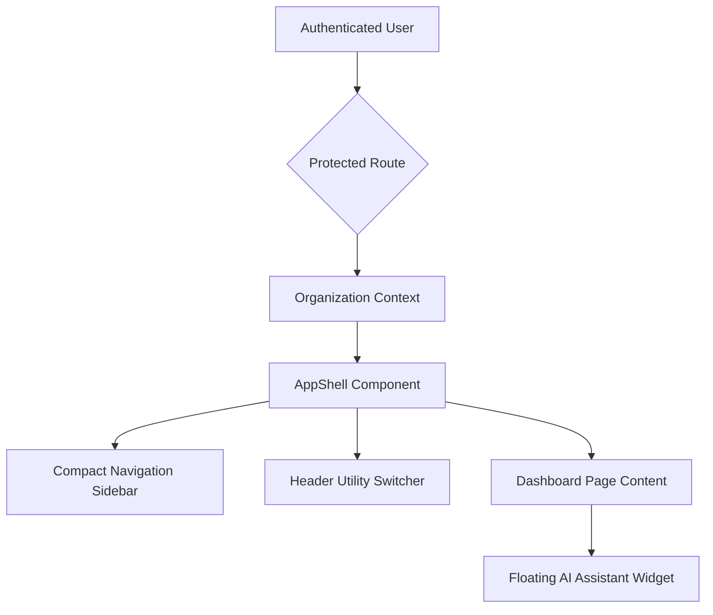

# HAZA AIOS Authenticated App Shell & Dashboard Architecture

This document describes the design and modular composition of the HAZA AIOS authenticated application shell and dashboard foundation.

## Layout Overview

## Reusable Components

We have created several generic presentational primitives inside `packages/ui/src/components/dashboard-primitives.tsx`:

1. `DashboardCard`: Container with premium dark background (`bg-slate-900/60`), border, and glow highlights on hover.
2. `StatCard`: Standard stat widget displaying titles, core values, positive/negative badges, and a custom inline sparkline SVG.
3. `AIAssistantWidget`: Text prompt utility box placed at the bottom center of the view.

## App Shell

The `AppShell` component manages:
- **Navigation Sidebar**: Data-driven, responsive sidebar that expands on hover for laptops and collapses to a compact rail on desktop viewports.
- **Mobile Menu**: Slides into view from the top left on mobile devices, ensuring full navigation capability.
- **Top Header Switcher**: Provides real-time workspace switcher capabilities, breadcrumbs, search triggers, and user profile management dropdown.

## Future API Integration

The data displayed on the dashboard is mock telemetry:
- Metrics (Active Users, Operations, Tasks, Health) can be replaced by mapping to real backend endpoints.
- SVG Sparklines and Bar charts accept simple arrays of numbers (`sparklineData`) to draw paths dynamically, meaning they can easily consume real timeseries logs when the API goes live.
