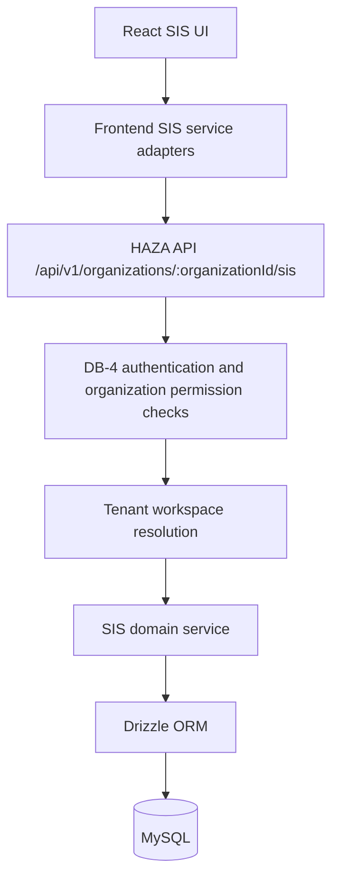
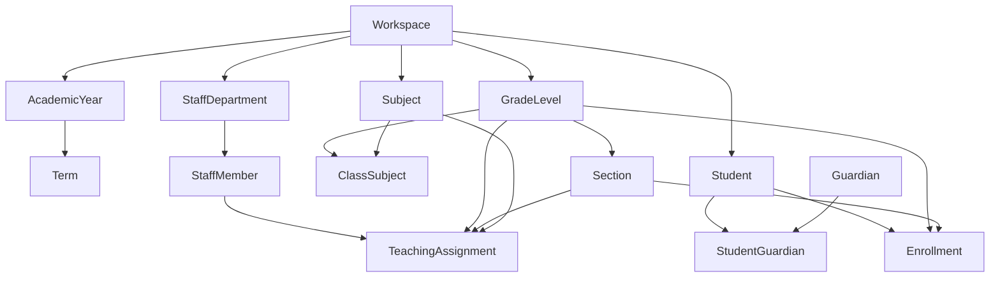

# DB-5 — SIS Core Persistence

## Scope

DB-5 migrates the HAZA Education SIS core domain from browser-local storage to the HAZA API, Drizzle ORM, and MySQL persistence stack introduced by DB-1 through DB-4.

Included domains:

- Academic structure: academic years, terms, grades/classes, sections, subjects, and class-subject assignments.
- Student information: students, guardians, and student-guardian relationships.
- Enrollment: student enrollment into academic year, grade/class, and section contexts.
- Staff and teachers: departments, staff members, and teaching assignments.

Explicitly deferred:

- Attendance and timetable persistence: DB-6.
- Examination, assessment, and results persistence: DB-7.
- Finance, communication, and portal persistence: later database phases.
- Analytics and agent persistence: later database phases.

## Architecture

The frontend keeps the existing SIS page contracts, but Academic, Student, Enrollment, Staff, and Teaching Assignment service methods now call the API instead of treating `localStorage` as production authority.

## ORM And Migration

ORM: Drizzle ORM with mysql2.

Migration:

- `apps/api/src/database/migrations/0003_zippy_venom.sql`
- `apps/api/src/database/migrations/meta/0003_snapshot.json`

Schema registration:

- `apps/api/src/database/schema.ts`

IDs remain application-generated UUID strings stored in `char(36)` columns. Tables use snake_case names and `created_at` / `updated_at` timestamps.

## Tables

Academic:

- `academic_years`
- `academic_terms`
- `grade_levels`
- `sections`
- `subjects`
- `class_subjects`

Staff:

- `staff_departments`
- `staff_members`
- `teaching_assignments`

Students and enrollment:

- `students`
- `guardians`
- `student_guardians`
- `enrollments`

Each runtime domain table is scoped to `workspace_id` directly or through parent records. API DTOs continue exposing `organizationId` for frontend compatibility.

## Relationships

## Constraints And Indexes

Important uniqueness constraints include:

- `academic_years`: workspace + name.
- `academic_terms`: academic year + name.
- `grade_levels`: workspace + name.
- `sections`: grade + name.
- `subjects`: workspace + code.
- `class_subjects`: grade + subject.
- `staff_departments`: workspace + name.
- `staff_members`: workspace + employee number.
- `teaching_assignments`: workspace + staff + academic year + grade + section + subject.
- `students`: workspace + admission number.
- `student_guardians`: student + guardian.
- `enrollments`: student + academic year + status.

Indexes are added for common tenant/status, class, staff, student, and ordering queries.

## API

The DB-5 API module is registered in `apps/api/src/app.ts` and implemented under:

- `apps/api/src/modules/education/education.module.ts`
- `apps/api/src/modules/education/sis.service.ts`

Route base:

- `/api/v1/organizations/:organizationId/sis`

Primary route groups:

- `/academic-years`
- `/terms`
- `/grades`
- `/sections`
- `/subjects`
- `/grades/:gradeId/subjects`
- `/departments`
- `/staff`
- `/teaching-assignments`
- `/students`
- `/enrollments`
- `/students/:studentId/transfer`

## Security

DB-5 reuses DB-4 authentication and organization permission checks:

- Read routes require `workspace.read`.
- Mutation routes require `workspace.manage`.

Server-side behavior:

- Resolves tenant workspace from the authenticated organization.
- Rejects cross-tenant record access by always filtering through workspace scope.
- Validates parent academic/staff/student references before insert where required.
- Maps uniqueness failures to safe API errors instead of raw ORM errors.

The education module activation row is respected when present and disabled. A missing activation row does not block SIS access so existing tenants without seeded module activation remain usable.

## Frontend Migration

Production localStorage authority was removed from the DB-5 core service adapters:

- `academic.service.ts`
- `student.service.ts`
- `enrollment.service.ts`
- `staff.service.ts`
- `teaching-assignment.service.ts`

Shared API adapter:

- `sis-api.ts`

`api-client.ts` now surfaces API error messages from JSON error bodies so existing SIS forms/tests receive domain-specific validation messages.

`apps/web/src/test/setup.ts` includes a test-only SIS API mock so legacy browser-unit tests can keep exercising service contracts without requiring a live API server. This mock is not production persistence.

## Tests

Added DB-5 API integration coverage:

- `apps/api/tests/sis-core.integration.test.ts`

Coverage includes:

- Academic structure persistence.
- Student, guardian, enrollment, staff, and teaching assignment persistence.
- Tenant isolation.
- Duplicate admission protection.
- Authenticated SIS API route access.
- Reconnect durability checks.

Existing integration test migration setup was made idempotent for already-created-table startup races:

- `apps/api/tests/database.integration.test.ts`
- `apps/api/tests/platform-core.integration.test.ts`

## Validation Results

Fresh DB-5 validation before commit:

- API typecheck: pass.
- API lint: pass.
- API build: pass.
- API DB integration tests: pass, 7 files / 39 tests.
- DB migration status: clean, 4 applied migrations.
- Web typecheck: pass.
- Web build: pass with existing large chunk warning.
- Web tests: pass on rerun, 29 files / 177 tests.
- Scoped lint for DB-5-touched frontend files: pass.

Known pre-existing debt:

- Full `npm run lint:web` still fails with the broad existing frontend lint backlog unrelated to DB-5.

## DB-6 Handoff

DB-6 should start from `develop` after DB-5 is merged. It may rely on these persistent DB-5 foundations:

- Real academic years, grades/classes, sections, and subjects.
- Real students, guardians, and enrollments.
- Real staff members and teaching assignments.

DB-6 should migrate only attendance and timetable/scheduling persistence.
