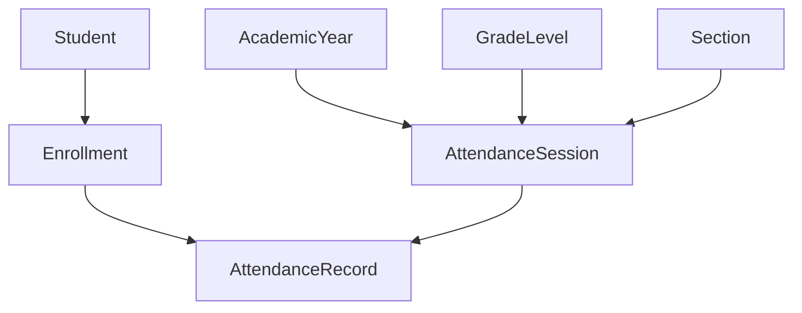
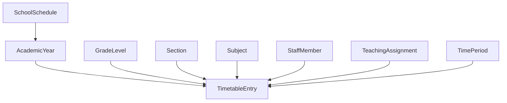

# DB-6 - Attendance & Timetable Persistence

DB-6 migrates Attendance Management and Timetable & Scheduling from browser-owned runtime storage to the HAZA API and MySQL persistence architecture.

## Scope

- Attendance sessions/registers
- Attendance records linked to active student enrollment
- School schedule configuration
- Time periods
- Timetable entries
- Teacher, class/section, and room conflict validation
- Frontend service adapters for Attendance and Timetable

The visual workspace design is intentionally unchanged. A separate workspace layout spacing fix is preserved in commit `06e6ecd`.

## Data Model

## Tables

- `attendance_sessions`
- `attendance_records`
- `school_schedules`
- `time_periods`
- `timetable_entries`

Attendance records reference both `student_id` and `enrollment_id`. The enrollment reference is authoritative for academic year, grade, and section context.

## Constraints And Indexes

- One attendance session per workspace, academic year, date, class/section, session type, and subject scope.
- One attendance record per session and enrollment.
- One timetable entry per class/section slot.
- One timetable entry per teacher slot.
- One timetable entry per room slot where `room_id` is supplied.
- Tenant-scoped indexes support class/date attendance, student attendance history, teacher timetable, and class timetable reads.

## API

Attendance:

- `GET /api/v1/organizations/:organizationId/sis/attendance/sessions`
- `POST /api/v1/organizations/:organizationId/sis/attendance/sessions`
- `GET /api/v1/organizations/:organizationId/sis/attendance/sessions/:id`
- `PATCH /api/v1/organizations/:organizationId/sis/attendance/sessions/:id`
- `GET /api/v1/organizations/:organizationId/sis/attendance/sessions/:id/records`
- `POST /api/v1/organizations/:organizationId/sis/attendance/sessions/:id/records`
- `GET /api/v1/organizations/:organizationId/sis/attendance/students/:studentId/history`
- `GET /api/v1/organizations/:organizationId/sis/attendance/students/:studentId/summary`

Timetable:

- `GET /api/v1/organizations/:organizationId/sis/timetable/schedules/:academicYearId`
- `PUT /api/v1/organizations/:organizationId/sis/timetable/schedules`
- `GET /api/v1/organizations/:organizationId/sis/timetable/periods`
- `PUT /api/v1/organizations/:organizationId/sis/timetable/periods`
- `DELETE /api/v1/organizations/:organizationId/sis/timetable/periods/:id`
- `GET /api/v1/organizations/:organizationId/sis/timetable/entries`
- `PUT /api/v1/organizations/:organizationId/sis/timetable/entries`
- `DELETE /api/v1/organizations/:organizationId/sis/timetable/entries/:id`

## Security

All routes use DB-4 authentication and tenant context. Reads require `workspace.read`; writes require `workspace.manage`.

Server-side validation prevents:

- Cross-tenant attendance writes
- Attendance records for students without active enrollment in the selected class context
- Timetable entries with cross-tenant academic, staff, subject, section, or period references
- Teacher double-booking
- Class/section double-booking
- Room double-booking when a room is provided
- Timetable entries that do not match an active DB-5 teaching assignment

## Frontend Integration

The existing service entry points remain stable:

- `AttendanceService`
- `timetableService`

The old attendance in-memory arrays and timetable `localStorage` authority are removed. Runtime reads/writes now go through `sisRequest`, which attaches the authenticated session token and calls the HAZA API.

## Validation

Completed during DB-6 implementation:

- `npm run db:migrate`
- `npm run db:migrate:status`
- `npm run typecheck:api`
- `npm run lint:api`
- `npm run build:api`
- `RUN_DB_INTEGRATION_TESTS=true npm run test:api`
- `npm run typecheck:web`
- `npm run build:web`
- `npm run test -w apps/web`
- Scoped ESLint for DB-6 touched web service/test files

Full `npm run lint:web` remains blocked by the existing frontend lint backlog unrelated to DB-6.

## Deferred Persistence

- Examinations, assessments, results: DB-7
- Finance: DB-8
- Communication: DB-8
- Parent/student portal domain data: DB-8
- Analytics: DB-9
- Agents: later phase

## DB-7 Handoff

DB-7 should start only after DB-6 is committed, pushed, merged into `origin/develop`, local `develop` is updated, and the working tree is clean.
