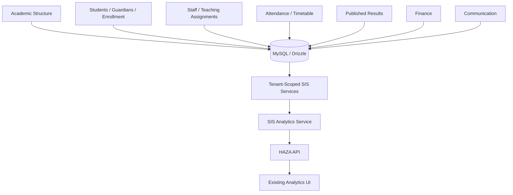
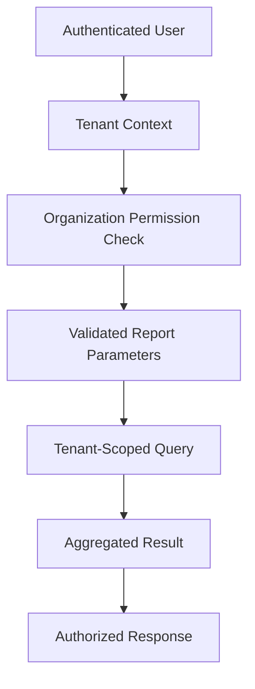

# DB-9 - SIS Analytics & Reporting Persistence

## Purpose

DB-9 moves SIS analytics and reporting authority from browser-side aggregation to the HAZA API. The existing Epic 10J analytics UI is preserved; data now comes from tenant-scoped API endpoints that derive metrics from persisted SIS tables.

## Scope

- Server-side analytics overview aggregation.
- Server-side report generation for the existing SIS report kinds.
- Server-side CSV export generation for existing report outputs.
- Frontend `analytics.service.ts` migration to a thin API adapter.
- Minimal DB-8 route-registration recovery required for finance, communication, and portal persistence to be reachable from the app.
- No analytics data duplication, report definition table, snapshot table, or generated file storage was added.

## Existing Analytics Audit

The previous frontend analytics service loaded all SIS source services and calculated totals, distributions, data-quality checks, health, report rows, and CSV exports in the browser. DB-9 keeps the same DTO shape and formulas, but executes them in `SisAnalyticsService` on the API.

## Architecture

## Data Sources

- Academic: `academic_years`, `academic_terms`, `grade_levels`, `sections`, `subjects`
- Students and enrollment: `students`, `guardians`, `student_guardians`, `enrollments`
- Staff: `staff_members`, `teaching_assignments`
- Attendance: `attendance_sessions`, `attendance_records`
- Timetable: `time_periods`, `timetable_entries`
- Results: `examinations`, `assessments`, `mark_records`, `result_publications`
- Finance: `finance_invoices`, `finance_payments`, `finance_receipts`
- Communication: `communication_messages`, `communication_deliveries`, `sis_notifications`, `announcements`
- Portal analytics: derived only from student/guardian portal-link fields.

## Formulas

- Attendance rate: `(present + late) / (present + absent + late) * 100`, rounded to two decimals. `excused` is excluded from the denominator.
- Result pass rate: passed published-result subject rows divided by all published-result subject rows, rounded to two decimals.
- Average performance: average published-result subject percentage, rounded to two decimals.
- Finance collection rate: collected cents divided by billed cents, rounded to two decimals. Integer cents remain authoritative for money.
- Outstanding balance: sum of non-void/non-cancelled invoice `balanceCents`.

## Reporting

Implemented report kinds remain:

- `student_directory`
- `staff_directory`
- `attendance_summary`
- `timetable_summary`
- `results_summary`
- `finance_collection`
- `communication_delivery`

Report definitions and snapshots are not persisted in DB-9 because the current product does not expose saved report configurations or asynchronous generated report files.

## Security

- Authentication is enforced before analytics route execution.
- Organization access requires `workspace.read`.
- Tenant context is resolved server-side from the organization id.
- Every source service query is scoped by the active workspace id.
- Cross-tenant filter ids are rejected when they are not present in the tenant source set.
- Published-result analytics use `result_publications` with `status === "published"` only.
- Finance analytics use integer cents and never use floating-point money as authoritative values.

## Query Performance

DB-9 reuses indexed DB-5 through DB-8 tables and existing SIS services. No materialized snapshot table was added. The current dashboard/report size is suitable for live aggregation; DB-10 or a later reporting phase can add snapshots if official frozen reporting or large-volume BI workloads appear.

## Frontend Migration

`apps/web/src/modules/education/sis/analytics.service.ts` now calls:

- `GET /api/v1/organizations/:organizationId/sis/analytics/overview`
- `GET /api/v1/organizations/:organizationId/sis/analytics/data-quality`
- `GET /api/v1/organizations/:organizationId/sis/analytics/health`
- `GET /api/v1/organizations/:organizationId/sis/reports/:kind`
- `GET /api/v1/organizations/:organizationId/sis/reports/:kind/export`

The service keeps the existing method names and return types for UI compatibility.

## Mock / Local Authority Retirement

Production analytics no longer uses hardcoded arrays, module-level mutable datasets, browser-local aggregation, or localStorage authority. Test fixtures in `apps/web/src/test/setup.ts` remain intentionally isolated test infrastructure.

## SIS Persistence Audit

- Academic Structure: database/API-backed
- Staff: database/API-backed
- Students: database/API-backed
- Guardians: database/API-backed
- Enrollment: database/API-backed
- Attendance: database/API-backed
- Timetable: database/API-backed
- Examinations: database/API-backed
- Results: database/API-backed
- Finance: database/API-backed
- Communication: database/API-backed
- Portal: API + database-backed policy/request data; dashboards are authorized projections
- Analytics: database-derived through API
- Reporting: database-derived through API

## Tests

- API integration covers real database analytics, reporting, CSV export, tenant isolation, cross-tenant filter protection, and report authorization.
- Web analytics service tests cover API-backed frontend compatibility using isolated test fixtures.

## Known Limitations

- Analytics-specific permissions are represented at the SIS service layer while the current persisted auth vocabulary only includes platform/organization/workspace/module/member permissions.
- Report pagination/export file storage is not required by the current product and was not added.
- The local migration status script still reports migration id `5` from the inherited DB-8 baseline even though the DB-8 migration file exists and Drizzle schema check passes.

## DB-10 Handoff

DB-10 can start after DB-9 is merged into `develop`, local `develop` is updated, and final post-merge validation passes. DB-10 should address Platform Core and Module Registry persistence only.
