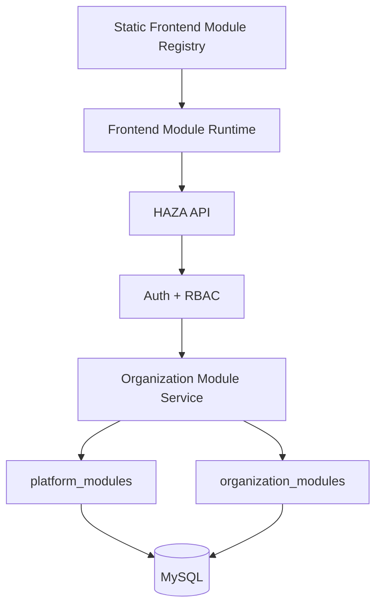
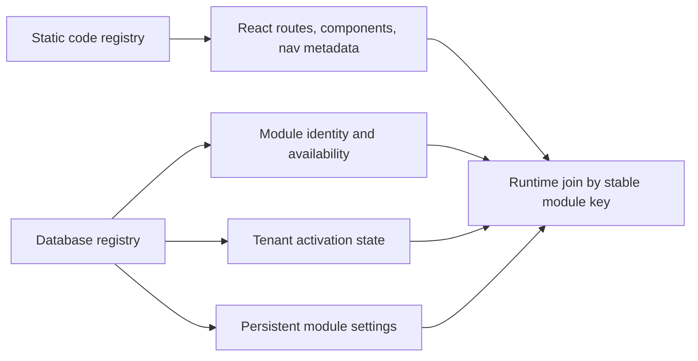

# DB-10 Platform Core and Module Registry Persistence

## Purpose

DB-10 moves platform-level module catalog and organization module activation authority behind the API and MySQL persistence layer established in DB-0 through DB-9.

This phase does not migrate SIS business data again. Education SIS data remains owned by DB-5 through DB-9. It also does not persist agent templates, agent instances, runs, memory, knowledge, conversations, or workflows; those remain DB-11 onward.

## Current-State Audit

| Component | Before DB-10 | After DB-10 |
| --- | --- | --- |
| Frontend module code registration | Static in-memory registry in `apps/web/src/modules` | Static registry remains for React components, routes, icons, permissions, and navigation |
| Module catalog metadata | Static frontend definitions | Persisted `platform_modules` catalog with stable module keys |
| Organization module activation | Backend `organization_modules` existed, but frontend runtime still used `localStorage` authority | API/database-backed organization activation |
| Module configuration | Frontend `localStorage` settings | API/database-backed JSON configuration on `organization_modules.settings` |
| Workspace/module page | Browser-local module runtime | API-backed runtime with test-only local fallback |
| Sidebar module navigation | Static runtime/default local state | Hydrated from API-backed runtime cache after organization load |

## Target Architecture

The split is intentional:

## Database Model

DB-10 adds `platform_modules`:

- `id`
- `module_key`
- `name`
- `description`
- `category`
- `industry`
- `version`
- `status`
- `is_core`
- `metadata`
- timestamps

`module_key` is unique and stable. `organization_modules.module_key` now references `platform_modules.module_key`.

Indexes:

- `platform_modules_key_unique`
- `platform_modules_status_idx`
- `platform_modules_industry_idx`
- existing `organization_modules_org_key_unique`
- existing `organization_modules_org_status_idx`

The DB-10 migration seeds current platform catalog rows idempotently for:

- `education-sis`
- `demo-analytics`
- `healthcare-ehr`
- `corporate-hr`

Runtime bootstrap in `OrganizationModuleService.ensureCatalog()` also upserts the same system catalog definitions so repeated API calls do not duplicate modules.

## Activation and Configuration

Current product architecture uses organization-scoped module activation. Workspaces are children of organizations and no workspace-level module selector currently exists. DB-10 therefore persists the current operative module boundary in `organization_modules` rather than adding unused workspace-level executable code or tables.

Activation invariants:

- module key must be valid
- module must exist in `platform_modules`
- module must be available
- organization must exist
- duplicate activation updates the existing row
- deactivation never deletes SIS data
- core modules cannot be deactivated if a future catalog row marks `is_core = true`
- configuration patching preserves activation state

Configuration is JSON stored in `organization_modules.settings`. API validation accepts JSON-safe object values only.

## API

DB-10 adds/extends:

- `GET /api/v1/modules`
- `GET /api/v1/organizations/:organizationId/modules`
- `POST /api/v1/organizations/:organizationId/modules`
- `PATCH /api/v1/organizations/:organizationId/modules/:moduleKey/config`
- `DELETE /api/v1/organizations/:organizationId/modules/:moduleKey`

Responses are DTOs, not raw ORM rows. Date fields are serialized as ISO strings and JSON columns are normalized at repository boundaries because MySQL drivers can return JSON as strings.

## Security

Authentication is required for catalog and activation APIs.

Tenant-specific module reads require `module.read`.

Activation, deactivation, and configuration changes require `module.manage`.

Tenant isolation is enforced by `AuthService.requireOrganizationPermission()`. A user authenticated in Organization A receives scoped not-found behavior when trying to manipulate Organization B module state.

## Frontend Integration

`ModuleRuntime` keeps static frontend module registration for executable code and route/nav definitions. Production module activation and settings are loaded through the API:

- `getAvailableModulesForOrgAsync`
- `toggleModuleActivationForOrgAsync`
- `updateModuleConfigurationForOrgAsync`

The old browser-local module state is retained only for Vitest mode so unit tests can run without a live API.

`WorkspaceModulesPage` now loads and toggles modules through the async API-backed runtime. `AppShell` hydrates dynamic navigation from the same runtime cache without changing shell styling.

## Remaining Local or Mock State

Remaining local/mock state after DB-10:

- static frontend module code registry: required for bundled React components and routes
- test-only module runtime fallback: isolated to `import.meta.env.MODE === "test"`
- agent registry/runtime localStorage: intentionally DB-11 onward
- workspace members/settings/activity localStorage: outside DB-10 except module activation authority
- education worksheet localStorage: agent artifact scope, not platform module activation
- platform admin mock data: platform admin retrofit remains separate

No production browser-local module activation authority remains in `ModuleRuntime`.

## Validation Scope

DB-10 validation covers:

- clean migration chain on `haza_aios_db10_test`
- platform catalog creation and idempotent bootstrap
- organization module activation persistence
- duplicate activation protection
- configuration persistence
- cross-tenant activation denial
- existing SIS and agent web test regression
- API/web typecheck and builds
- scoped lint for changed DB-10 files

Full web lint has existing baseline debt in agent/SIS/UI files unrelated to DB-10; DB-10 validation uses scoped lint for changed files.

## DB-11 Handoff

DB-11 should persist AI Agent Registry and Configuration. It should not reopen DB-10 module activation unless agent platform availability needs a catalog row or entitlement rule.
