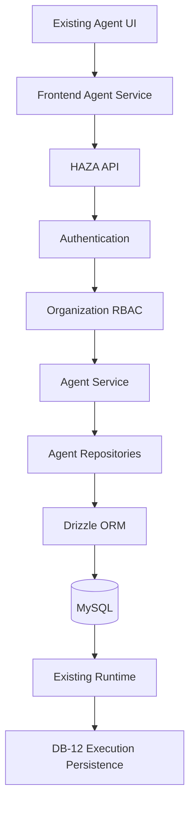
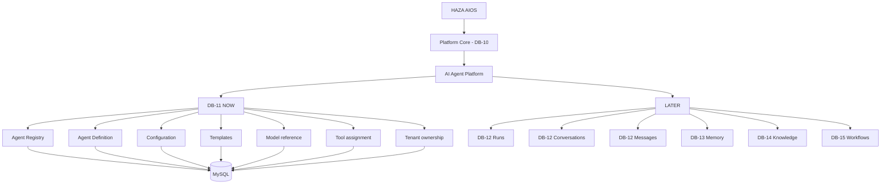

# DB-11 - AI Agent Registry and Configuration Persistence

## Purpose

DB-11 begins the HAZA AIOS AI Agent Platform persistence retrofit. It moves agent registry templates, tenant-owned agent definitions, agent configuration, lifecycle state, workspace ownership, provider/model references, and tool assignments into MySQL through the existing Drizzle ORM, repository, service, API, and RBAC architecture.

DB-11 does not persist execution runs, conversations, messages, long-term memory, knowledge documents, embeddings, or workflow execution. Those remain explicitly deferred to DB-12 through DB-15.

## Previous Architecture

| Component | Previous authority | Previous storage | DB-11 target |
| --- | --- | --- | --- |
| Agent templates | Static frontend registration | In-memory `AgentRegistry` seeded from `agent-service.ts` | API/database-backed system templates |
| Agent definitions | Frontend `AgentService` | `localStorage` key `haza-aios.agents.instances` | MySQL `ai_agent_definitions` |
| Agent configuration | Frontend `AgentService` | Nested JSON in localStorage instances | MySQL JSON plus explicit provider/model columns |
| Tool assignments | Agent config array | `configuration.tools` in localStorage | MySQL `ai_agent_tool_assignments` plus config readback |
| Agent runs | Frontend runtime placeholder | `localStorage` key `haza-aios.agents.runs` | DB-12 |
| Conversations/messages | Frontend runtime placeholder | localStorage runtime services | DB-12 |
| Memory | Frontend runtime placeholder | localStorage memory services | DB-13 |
| Knowledge | Frontend runtime placeholder | static/mock runtime services | DB-14 |
| Workflows | Frontend runtime placeholder | localStorage workflow services | DB-15 |

## Target Architecture

## Platform Boundary

## Persistence Model

DB-11 adds:

- `ai_agent_templates`: platform/system agent templates available to authorized organization users.
- `ai_agent_definitions`: tenant-owned agent definitions scoped by organization and workspace.
- `ai_agent_tool_assignments`: durable mapping of enabled tool keys for each agent definition.

Agent definitions use stable UUID primary keys suitable for DB-12 agent-run foreign keys. Template activation is idempotent per workspace through a unique `(workspace_id, template_id)` constraint. Agent keys are unique per workspace through `(workspace_id, agent_key)`.

## Templates

The previous static template seed is now represented as database system templates:

- `worksheet-creator`
- `sales-analyzer`

The frontend `AgentRegistry` remains as a runtime/cache contract for existing UI components, but production template authority is the API/database catalog.

## Configuration

Agent configuration remains compatible with the existing `AgentConfiguration` frontend shape. DB-11 persists it as JSON while also storing searchable provider/model references:

- `model_provider`
- `model_selection`
- `instructions`

The service validates that provider secrets are not included in agent configuration. DB-11 stores non-secret provider/model references only. Credential management remains future platform infrastructure.

## Tool Assignments

Executable tool implementations remain code-owned through the existing static `ToolRegistry`. DB-11 persists only which tool keys an agent is authorized to use. This mirrors the DB-10 boundary where executable module UI remains code while activation/configuration becomes database-backed.

## API

New authenticated organization-scoped endpoints:

- `GET /api/v1/organizations/:organizationId/agents/templates`
- `GET /api/v1/organizations/:organizationId/agents`
- `GET /api/v1/organizations/:organizationId/agents/:agentId`
- `POST /api/v1/organizations/:organizationId/agents`
- `PATCH /api/v1/organizations/:organizationId/agents/:agentId/configuration`
- `PATCH /api/v1/organizations/:organizationId/agents/:agentId/status`

All tenant endpoints require server-side authentication and organization permission checks. Cross-tenant access returns `404` through the same tenant isolation pattern used in DB-3 through DB-10.

## RBAC

DB-11 adds:

- `agent.read`
- `agent.manage`

Owner and Admin roles receive both permissions. Member receives read-only agent registry access.

## Frontend Migration

`apps/web/src/agents/agent-service.ts` now uses API-backed production reads/writes for templates, agent definitions, activation, status updates, and configuration updates.

Test mode retains the existing localStorage fallback so existing browser-unit tests remain deterministic. Runtime run history still uses localStorage because execution persistence is DB-12 scope.

No protected visual design files were modified for DB-11.

## Security

- Authentication: server-side through `AuthService`.
- Tenant context: organization ID validated and permission checked server-side.
- RBAC: `agent.read` and `agent.manage`.
- IDOR: agent reads/writes require matching organization ownership.
- Cross-tenant read/write: denied.
- Provider secrets: rejected from agent configuration.
- SQL injection: Drizzle query builders and parameterized migration execution.

## Validation

DB-11 validation covers:

- API typecheck
- Web typecheck
- API build
- Web build
- API test suite
- Web test suite
- Scoped DB-11 lint
- Clean DB migration chain
- DB-backed agent registry integration
- Template seed persistence
- Agent definition persistence
- Configuration persistence
- Tool assignment persistence
- Duplicate activation idempotency
- Multi-client/restart-style readback
- Cross-tenant read/write denial
- Provider secret rejection

## Remaining Local and Mock Authority

Remaining by design:

- Agent runs: localStorage until DB-12.
- Conversations/messages: localStorage until DB-12.
- Memory: localStorage until DB-13.
- Knowledge: static/mock runtime retrieval until DB-14.
- Workflow execution: localStorage until DB-15.
- Test-only agent localStorage fallback: retained for Vitest/browser unit tests only.

Removed for production authority:

- Agent template registry as the source of truth.
- Agent definition localStorage authority.
- Agent configuration localStorage authority.

## DB-12 Handoff

DB-12 should build on `ai_agent_definitions.id` for:

- agent runs
- conversation records
- persisted messages
- runtime status transitions
- execution input/output records

DB-12 must not redesign the agent UI and should preserve the DB-11 definition/configuration boundary.
