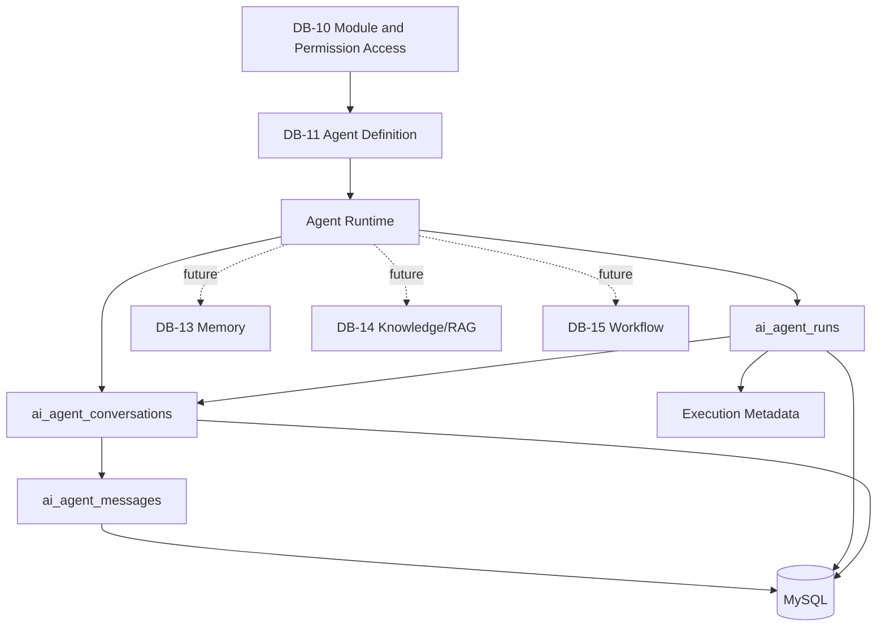
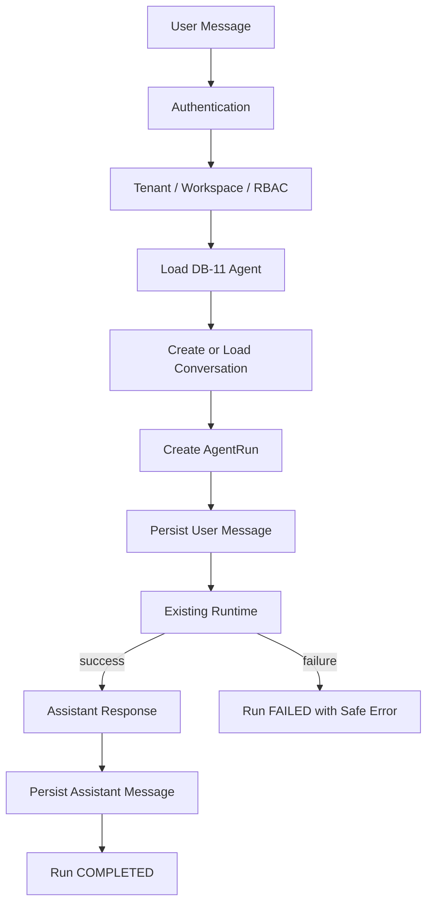

# DB-12 - Agent Runtime, Runs & Conversation Persistence

## Purpose

DB-12 moves the HAZA AIOS agent execution history layer from browser-local authority to MySQL-backed API authority.

DB-11 answers what agent exists and how it is configured. DB-12 answers what happened when an agent executed.

## Scope

Implemented:

- Persistent agent runs.
- Run lifecycle status: queued, running, waiting, completed, failed, cancelled.
- Persistent conversations.
- Persistent conversation messages.
- Deterministic message ordering with `conversation_id + sequence` uniqueness.
- Agent to run, agent to conversation, conversation to message relationships.
- Organization, workspace, agent, user, and run foreign keys.
- Server-side timestamps for run creation and completion.
- Safe failure persistence with sanitized error messages.
- Provider/model metadata copied from the DB-11 agent definition.
- API pagination through `limit` and `offset`.
- Frontend runtime integration for API-backed run/conversation history in production.
- Test-local fallback retained for Vitest browser-local tests only.

## Explicit Exclusions

Deferred by design:

- Long-term agent memory: DB-13.
- Knowledge documents, embeddings, vector search, and RAG: DB-14.
- Workflow persistence and workflow execution state: DB-15.
- Usage charging and SaaS metering: DB-17.

Conversation history is not agent memory. DB-12 records what was said and what ran; it does not extract reusable facts or preferences.

## Previous Runtime Authority

| Component           | Previous Authority | Previous Storage | DB-12 Target        |
| ------------------- | ------------------ | ---------------- | ------------------- |
| Agent definitions   | API/database       | MySQL            | Unchanged DB-11     |
| Agent configuration | API/database       | MySQL            | Unchanged DB-11     |
| Agent runs          | Frontend           | `localStorage`   | MySQL/API           |
| Conversations       | Frontend           | `localStorage`   | MySQL/API           |
| Messages            | Frontend           | `localStorage`   | MySQL/API           |
| Runtime dispatch    | Frontend process   | In memory        | Transient in memory |
| Long-term memory    | Frontend prototype | `localStorage`   | Deferred DB-13      |
| Knowledge/RAG       | Frontend prototype | Mock/local       | Deferred DB-14      |
| Workflow state      | Frontend prototype | `localStorage`   | Deferred DB-15      |

## Architecture

## Execution Flow

## Database Schema

### `ai_agent_conversations`

Stores user-owned conversation containers scoped by organization, workspace, and agent.

Important fields:

- `organization_id`
- `workspace_id`
- `agent_id`
- `user_id`
- `title`
- `agent_conversation_status`
- `last_message_at`

Indexes:

- `organization_id + user_id`
- `workspace_id + agent_id + status`
- `workspace_id + last_message_at`

### `ai_agent_runs`

Stores runtime execution records.

Important fields:

- `organization_id`
- `workspace_id`
- `agent_id`
- `conversation_id`
- `requested_by`
- `agent_run_status`
- `execution_mode`
- `idempotency_key`
- `input`
- `output`
- `provider`
- `model`
- `error_code`
- `safe_error_message`
- `metadata`
- `started_at`
- `completed_at`
- `duration_ms`

Indexes and constraints:

- Unique `workspace_id + agent_id + idempotency_key` for duplicate request protection when callers supply a stable key.
- `organization_id + status`.
- `workspace_id + agent_id + status`.
- `conversation_id`.
- `requested_by`.

### `ai_agent_messages`

Stores conversation messages.

Important fields:

- `organization_id`
- `workspace_id`
- `conversation_id`
- `agent_run_id`
- `agent_message_role`
- `sequence`
- `content`
- `metadata`

Ordering:

- Messages are ordered by explicit integer `sequence`.
- The database enforces unique `conversation_id + sequence`.

## API

Added endpoints:

- `POST /api/v1/organizations/:organizationId/agents/:agentId/runs`
- `GET /api/v1/organizations/:organizationId/agents/:agentId/runs`
- `GET /api/v1/organizations/:organizationId/agent-runs/:runId`
- `PATCH /api/v1/organizations/:organizationId/agent-runs/:runId`
- `POST /api/v1/organizations/:organizationId/agent-conversations`
- `GET /api/v1/organizations/:organizationId/agent-conversations`
- `GET /api/v1/organizations/:organizationId/agent-conversations/:conversationId`
- `GET /api/v1/organizations/:organizationId/agent-conversations/:conversationId/messages`
- `POST /api/v1/organizations/:organizationId/agent-conversations/:conversationId/messages`

The `agent-conversations` and `agent-runs` route prefixes avoid conflicts with the existing simple router and its `/agents/:agentId` route.

## Transaction Design

DB-12 keeps database transactions short:

- Transaction 1 creates/loads the conversation, creates the run, and persists the user message.
- Runtime/model execution remains outside long database transactions.
- Transaction 2 marks completion/failure and persists the assistant message when a run completes.

## Security

DB-12 enforces:

- Server-side authentication through `AuthService`.
- Organization permission checks through `agent.read`.
- Agent ownership through `organization_id` and DB-11 agent lookup.
- Conversation ownership through `organization_id + user_id`.
- Message ownership through authorized conversation lookup.
- Cross-tenant run/conversation/message access returns not found.
- System messages cannot be written through the public runtime message API.
- Runtime metadata rejects secret-like payloads.
- Failed-run errors are sanitized before persistence.
- Provider API keys, credentials, authorization headers, and tokens are not persisted.

## Frontend Migration

Production runtime now calls DB-12 APIs through:

- `apps/web/src/agents/agent-service.ts`
- `apps/web/src/agents/runtime/conversation/ConversationService.ts`
- `apps/web/src/agents/runtime/AgentRuntime.ts`
- `apps/web/src/agents/runtime/AgentExecutor.ts`
- `apps/web/src/agents/runtime/ContextEngine.ts`

Vitest mode keeps browser-local test fallback so existing unit tests can continue without a backend server.

## Validation

Validated during implementation:

- API typecheck: pass.
- Web typecheck: pass.
- Normal API tests: pass, with DB integration tests skipped unless explicitly enabled.
- Isolated DB-12 integration test: pass against `haza_aios_db12_test5`.
- API build: pass.
- Web build: pass.
- Drizzle schema check: pass.
- Development database migration status: clean after repairing a pre-existing DB-10 journal mismatch.

Baseline debt observed before DB-12:

- Web lint has existing historical lint violations unrelated to DB-12.
- Full DB-enabled API suite uses a shared test database and can collide under concurrent migration execution.

## DB-13 Handoff

After DB-12:

| Area                     | Authority              |
| ------------------------ | ---------------------- |
| Platform Module Registry | Database - DB-10       |
| Agent Definitions        | Database - DB-11       |
| Agent Configuration      | Database - DB-11       |
| Agent Runs               | Database - DB-12       |
| Conversations            | Database - DB-12       |
| Messages                 | Database - DB-12       |
| Transient Runtime State  | In memory - legitimate |
| Long-Term Memory         | Not yet - DB-13        |
| Knowledge/RAG            | Not yet - DB-14        |
| Workflows                | Not yet - DB-15        |
