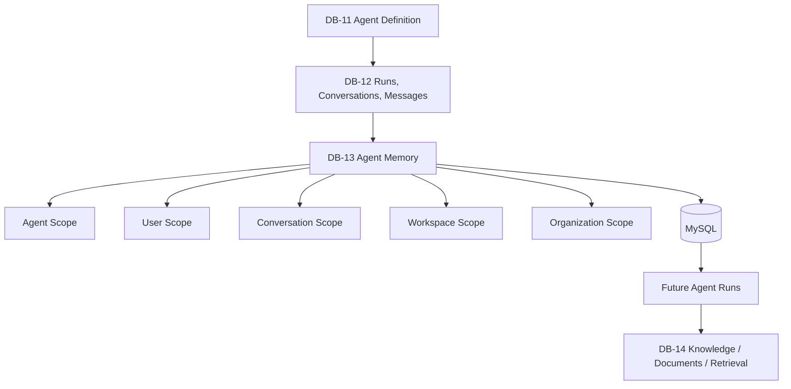
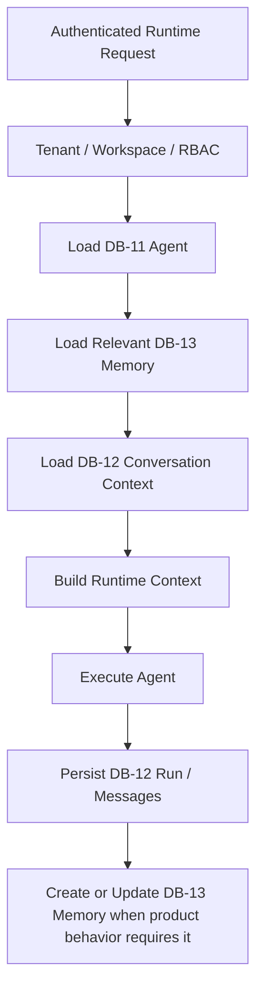

# DB-13 Agent Memory Persistence

DB-13 moves long-term agent memory from browser-local prototype storage to the HAZA AIOS backend database authority. DB-12 continues to own run, conversation, and message history; DB-13 owns selected durable facts, preferences, instructions, and context that an agent may reuse later.

## Scope

Implemented in DB-13:

- Durable `ai_agent_memories` records in MySQL.
- Organization, workspace, agent, and optional user ownership.
- Memory scopes: `user`, `agent`, `conversation`, `workspace`, and `organization`.
- Memory types: `fact`, `preference`, `context`, `task_state`, and `instruction`.
- Active/archive/delete lifecycle through `active`, `archived`, and `deleted`.
- Source traceability to DB-12 run, conversation, and message records.
- Importance, expiration, usage count, and last-used metadata.
- API-backed create, list, read, update, and forget/delete behavior.
- Runtime memory retrieval through the existing Context Engine path.
- Tenant, workspace, user, and agent isolation.
- Secret-like content rejection before durable storage.

Explicitly excluded from DB-13:

- Knowledge documents and uploaded files.
- Chunking, embeddings, vector databases, vector search, and RAG.
- Workflow persistence and workflow execution.
- SaaS billing, metering, and production hardening.

## Conversation vs Memory

Conversation history is chronological and exact. It records what happened during agent execution and is persisted by DB-12 in conversations, messages, and runs.

Agent memory is selective and durable. It records reusable information such as user preferences or agent-specific context, without copying full conversations into memory.

## Memory vs Knowledge

Memory is contextual state remembered by an agent. Knowledge is external content used for retrieval and grounding. DB-13 implements memory only. Knowledge documents, retrieval, embeddings, and RAG remain DB-14 scope.

## Previous Architecture

| Component                 | Previous authority         | Previous storage                               | DB-13 authority            |
| ------------------------- | -------------------------- | ---------------------------------------------- | -------------------------- |
| Long-term memory records  | Frontend service           | `localStorage` key `haza-aios.agents.memories` | API/MySQL                  |
| Memory retrieval          | Frontend filter            | Browser-local array                            | Tenant-scoped backend list |
| Memory creation           | Frontend runtime heuristic | Browser-local array                            | API-backed create          |
| Memory update             | Not durable across clients | Browser-local mutation                         | API-backed patch           |
| Forget/delete             | Browser-local mutation     | Browser-local mutation                         | Persistent deleted status  |
| Runtime context injection | Context Engine             | Frontend service                               | API-backed retrieval       |

Test mode keeps localStorage fallback for deterministic browser unit tests only. Production long-term memory authority is no longer browser localStorage.

## Target Architecture

## Runtime Memory Flow

## Database Schema

`ai_agent_memories` contains:

- `organization_id`, `workspace_id`, and `agent_id` for tenant/workspace/agent ownership.
- `user_id` for user-private and conversation-scoped memory.
- `agent_memory_scope` and `agent_memory_status` enums.
- `type`, `content`, `source`, `importance`, and `metadata`.
- Optional source references: `source_run_id`, `source_conversation_id`, `source_message_id`.
- `created_by`, `updated_by`, `expires_at`, `last_used_at`, and `usage_count`.

Indexes support organization/status, workspace/scope/status, agent/scope/status, user/status, and source reference lookups.

## API

DB-13 extends the existing agent API module:

- `GET /api/v1/organizations/:organizationId/agents/:agentId/memories`
- `POST /api/v1/organizations/:organizationId/agents/:agentId/memories`
- `GET /api/v1/organizations/:organizationId/agent-memories/:memoryId`
- `PATCH /api/v1/organizations/:organizationId/agent-memories/:memoryId`
- `DELETE /api/v1/organizations/:organizationId/agent-memories/:memoryId`

List endpoints retrieve active memory by default and support deterministic filters for limit, offset, type, scope, status, and conversation ID.

## Ownership And Privacy

User and conversation memories require the current authenticated user. Shared agent, workspace, and organization memory require `agent.manage` permission. All endpoints require server-side authentication and at least `agent.read` to enter the memory API boundary.

Foreign organization access returns `404` through the existing tenant isolation pattern. Source references are validated against DB-12 ownership before memory creation.

## Source Traceability

When memory is derived from DB-12 execution history, it may reference:

- `source_run_id`
- `source_conversation_id`
- `source_message_id`

The service validates these records belong to the same organization, workspace, agent, and authenticated user where applicable.

## Runtime Integration

The frontend Context Engine still assembles runtime context in the same UI flow, but production memory retrieval now calls the backend through `MemoryService.getMemoriesForAgent`. Explicit `remember that` / `remember:` runtime behavior now creates persistent DB-13 memory in production and localStorage fallback in test mode.

Memory is injected as bounded deterministic context. DB-13 does not implement semantic retrieval or vector similarity.

## Sensitive Data Handling

Memory validation rejects high-confidence secret-like content before durable storage, including API keys, GitHub tokens, bearer tokens, and password assignment patterns. Memory content is still treated as untrusted context when injected into runtime prompts.

## Validation

DB-13 includes an integration test covering:

- Migration application on a fresh database.
- Memory creation with DB-12 source traceability.
- Secret-like memory rejection.
- Authorized memory listing and retrieval.
- Restart durability through a second API/database client.
- Memory update persistence.
- Foreign tenant access denial.
- Persistent forget/delete behavior.

## Known Limits

- No embeddings, vector search, or RAG are implemented.
- Workspace/organization memory is supported only as deterministic shared memory through `agent.manage`.
- Test-mode localStorage fallback remains for frontend unit tests.
- Workflow memory behavior remains DB-15 scope.

## DB-14 Handoff

DB-14 should implement knowledge base, document, and retrieval persistence without reusing DB-13 memory as a document store. Agent memory can later reference retrieved knowledge by ID if the product requires source traceability across DB-13 and DB-14.
